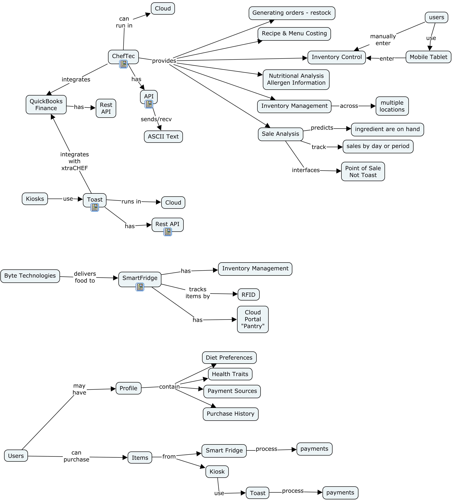
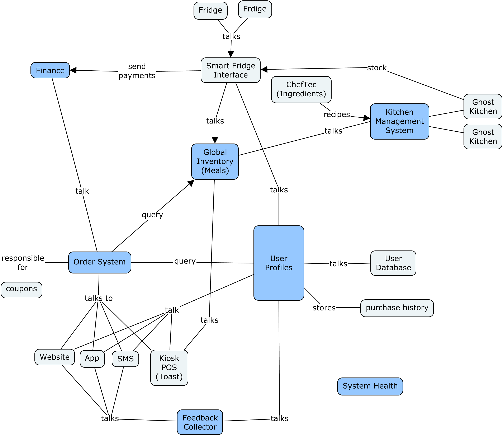

# Brainstorm Sessions
Contain notes on what the existing system capabilities are today.

## Existing System Concept Map

## Major Component Identification

### Major Components
- `Finance` - Is the single source of truth for financial transactions.
- `Global Inventory` - Hold an inventory of meals stored at Kiosks or Smart Fridges. It will interface with the Smart Fridge and Kiosk (Toast) cloud systems to collate all meal in a single place.
- `Kitchen Management` - This is used by the Ghost Kitchen to create meals and set pricing.
- `Order System` - Order system is an abstraction to handle the multiple modes of ordering: Website, Mobile App, SMS, Kiosk orders.
- `User Profiles` - Hold user profiles that include health preferences, purchase history, and possibly a reference to payment sources: credit card, loyalty programs, etc.
- `Feedback Collector` - Used to gather feedback from users
- `System Health` - a system monitor tool to measure the health of the system. Are Smart Fridges talking?, are servers up?

### Questions
1. Is feedback it's own component [ADR_001](../ArchitectureDecisionRecords/001_FeedbackComponentAMajorComponent)?
2. Can reservations happen?
    - What happens if user does not pick up meals?
    - What happens if another user pick up meals?
3. Are there custom made to order meals?

### Assumptions
1. We are assuming that no custom made to order meals are offered at the moment.
2. ChefTec does have an inventory system, but we are assuming that it will handle only raw ingredients to make meals at the Ghost Kitchen and not be used to handle the inventory of meals stored in Smart Fridges.

