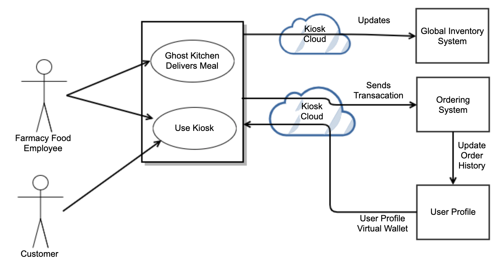

# Farmacy Foods Software Architecture

- [Farmacy Food Operational Assumptions](#farmacy-food-operational-assumptions)
- [Software Architecture](#software-architecture)
- [Component Descriptions](#component-descriptions)
  * [Smart Fridge](#smart-fridge)
  * [Kiosk (Toast)](#kiosk--toast-)
  * [Ordering System](#ordering-system)
  * [Finance](#finance)
  * [Kitchen Management](#kitchen-management)
  * [Global Inventory System](#global-inventory-system)
  * [User Profile](#user-profile)
  * [Analytics](#analytics)
  * [System Health](#system-health)

## Farmacy Food Operational Assumptions
We assume each Farmacy Food location has the following operational configuration:

1. Smart Fridge Only - Fully automated with no personnel.
2. Kiosk Only - Farmacy Food personnel sell meals using Toast Kiosk.
3. Both the Smart Fridge and Kiosk are collated in the same space.
4. There are one or more Ghost Kitchens that make meals for delivery to the Smart Fridges.
5. ChefTec is used to aid in meal pricing and inventory management of raw ingredients only (components to make meals). It does not manage the inventory of meals that are stored in the Smart Fridges.
6. No Delivery of meals to customer.
7. Best Attempt Reservation System.
8. Kiosk locations can enforce reservation, because customers don't have direct access to foods.

## Software Architecture

## Component Descriptions

### Smart Fridge
Smart Fridge is a 3rd party system that is currently being used by Farmacy foods to sell meals or products. It has its interface that can be customized, and each fridge handles the processing of payments. All smart fridges communicate to a central cloud-based system to manage inventory.

*Assumptions:*
1. We assume the Smart Fridge Inventory will only manage meals and not raw ingredients to make the meals.

*Questions:*
1. Can a new customers create an account from the fridge?

### Kiosk (Toast)
Kiosks are used to sell meals or products that are not stored in Smart Fridges and require Farmacy Food personnel to be present for transactions to occur.

*Assumptions:*
1. Kiosks can be used to scan meals upon delivery from the Ghost Kitchen to update inventory.
2. Kiosks can be used to pull up customer accounts to purchase products (Virtual Wallet).

### Ordering System
Since orders can arrive from multiple sources (Website, Mobile App, SMS, Kiosk, Smart Fridges), this system provides a central location where order transactions are recorded. This system may also aid in the processing of payments if it does not have a payment gateway.

#### Customer Interfaces
There are multiple ways to order food.

**Website** 
Customers can go to a website to order food, update user-profiles, and add health traits.

**Mobile App** 
Customers can download a mobile app to order food, update user-profile, and add health traits.

**SMS Ordering** 
Customers can send a text to order food.

**Kiosk** 
Customers will likely directly interact with this interface, but a Farmacy Food employee could use the Kiosk to pull up a customer's stored payment information.

### Finance
Currently, QuickBooks is being used to manage FarmacyFood finances. The system will be the single source of truth for all finances that leave and enter Farmacy Foods.

### Kitchen Management
The Ghost Kitchen uses the Kitchen Management component to set pricing, see which Smart Fridges are low on inventory, and provide a user interface to ChefTec.

ChefTec validates meal pricing and manages raw material inventory. It also has the ability to order raw ingredients from vendors when the drop below a certain threshold.

This system will also have a user interface to simplify the ChefTec system to only information needed by the Ghost Kitchen.

### Global Inventory System
There are currently three systems that manage inventory: ChefTec, Smart Fridges, and Kiosks. The main problem statement is to integrate all the inventory management systems into a single source of truth. The Global Inventory will be the single source of truth for products ready to sell to customers, and ChefTec will remain a separate entity to manage raw ingredients/components inventory.

*Assumptions:*
Kiosks can be used to update the Global Inventory System. For example, Ghost Kitchen delivers a meal, Farmacy Food employee scans the meal to update the inventory.

### User Profile
This component will store user-health traits and goals, order history, and payment preferences of users.

### Analytics
This component provides data analytics for the system and will be responsible for managing and processing user feedback.

### System Health
This component is used to monitor the system's health in real-time and send out alerts for critical failures (Fridged powered down).

Also, this component will provide a central point to send logging data from the various systems.

*Assumption:*
1. Some form of an ELK stack will be used to process log data.

